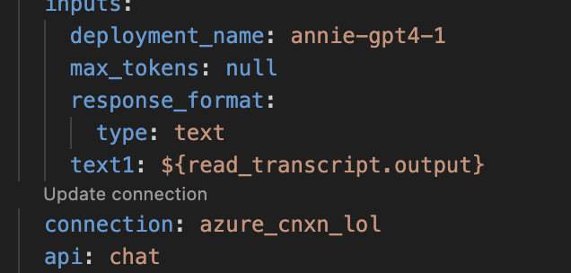

- [**Overview**](#overview)
  - [diarization](#diarization)
  - [types of models and pipelines](#types-of-models-and-pipelines)
  - [evaluation and metrics](#evaluation-and-metrics)
- [usage](#usage)
  - [set up environment](#set-up-environment)
  - [input data](#input-data)
  - [creating promptflow connection](#creating-promptflow-connection)
  - [edit promptflow yaml with connection name and output directory](#edit-promptflow-yaml-with-connection-name-and-output-directory)
  - [run gpt4, gpt4o, gpt3.5, or mixtral using promptflow](#run-gpt4-gpt4o-gpt35-or-mixtral-using-promptflow)
  - [run a test promptflow](#run-a-test-promptflow)
  - [run a batch promptflow](#run-a-batch-promptflow)
  - [run llama or claude model using python](#run-llama-or-claude-model-using-python)

# <span style="color:purple">**Overview**</span>

## diarization

## types of models and pipelines

## evaluation and metrics

*creation of gold-standard set:*


# usage
hello `run.py`
## set up environment

```shell

conda env create -f diarize_env.yaml -y
conda activate diarize

```
## input data
format and where they are from

## creating promptflow connection
see promptflow's instructions for creating a connection to your model deployment (e.g. via azure):


describe briefly

## edit promptflow yaml with connection name and output directory

In the desired flow folder, there will be a file called "flow.dag.yaml". Open this file and you will see, for each LLM node, a place to edit the connection name and associated deployment name. Change "deployment_name" to whatever your model deployment is called on azure, and "connection" to whatever you named your connection.

<p align="center">
  
</p>


## run gpt4, gpt4o, gpt3.5, or mixtral using promptflow
describe each one


## run a test promptflow
describe jsonl

```shell
export BASE_FLOW_PATH="/work/bioinformatics/s229618/diarization/"
# edit path with flow name [e.g. prompt_diarize_3chunk, prompt_diarize_1chunk]
# change below to batch command
python -m promptflow._cli._pf.entry flow test --flow $BASE_FLOW_PATH/prompt_diarize_3chunk

```

## run a batch promptflow
Run a batch of transcripts using jsonl file with IDs (see input data)

```shell
export BASE_FLOW_PATH="/work/bioinformatics/s229618/diarization/"
# edit yaml file with desired flow (and/or file path if using separate yaml)
python -m promptflow._cli._pf.entry run create --stream --file helper_files/pf_batch_run.yaml

```

## run llama or claude model using python

--config_path required argument, default configs stored in config.yaml:

```shell

python run.py --config_path config.yaml 

```

*description of configs and allowed values:*

**temperature:**

**top_p:**

**max_new_tokens:**

**do_sample:**

**mod_name:**


With additional optional args (change paths to desired paths):

```shell

python run.py --config_path config.yaml --data_path 'path.jsonl' --summary_path 'summarypath.txt' --diarize_path 'diarizepath.txt' --output_dir 'path/diarized/'

```
**data_path:** path to jsonl file with IDs to diarize (see helper_files/ids.jsonl)

**summary_path:** path to summary prompt, default in helper_files/summary_prompt.txt

**diarize_path:** path to diarization prompt, default in helper_files/diarize_prompt.txt

**output_dir:** path to directory to save diarization output
